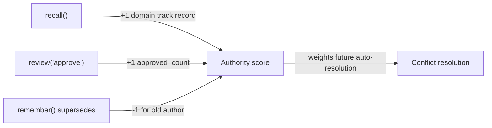

# Knowledge Guidelines

What to store, what to skip, confidence floors, and domain conventions.

---

## What to store

| Type | Trigger | Example |
|------|---------|---------|
| **Decision** | Architectural or technical choice with rationale | "Use JWT over sessions — Lambda is stateless" |
| **Pattern** | Reusable approach the team has adopted | "Error responses follow RFC 7807 Problem Detail" |
| **Constraint** | Non-functional requirement or technical boundary | "Lambda functions cannot use persistent filesystem" |
| **Runbook** | Operational procedure or non-obvious fix | "Rotate KMS key: notify team 48h before, then..." |
| **Requirement** | Business or technical requirement with acceptance criteria | "All API calls must complete within 300ms p99" |

## What NOT to store

- Information already in git history, PRs, or source code comments
- Trivial facts with no governance value ("I used a for-loop")
- Temporary workarounds you intend to revert
- Personal preferences not agreed upon by the team
- Secrets, credentials, or PII

## The quality bar for reflect()

Ask: *"If a senior engineer asked 'why did you do X?', would this entry be the answer?"*

Good: "Used polling instead of push callbacks because the upstream API does not support webhooks"
Bad: "Used a for-loop to iterate the array"

---

## Over-extraction guard

Do NOT call `reflect()` for these session types:

| Session type | Action |
|-------------|--------|
| Pure read session (recall, search only) | Skip |
| Debugging with no architectural decisions | Skip |
| Task abandoned or rolled back | Skip |
| Documentation only, no implementation | Skip |
| Repeated work already covered by existing knowledge | Skip |

---

## Confidence guidelines

| Role | Base confidence floor |
|------|-----------------------|
| Principal Architect | 0.90 |
| Senior Engineer | 0.80 |
| Engineer | 0.70 |
| Junior | 0.60 |
| Claude / reflect | 0.55 (always DRAFT) |
| Anonymous | 0.50 (always DRAFT) |

The server applies your role's floor automatically — do not pass a value below it.
Confidence evolves after storage:
- **+** recalled frequently by multiple sessions
- **+** approved by reviewers
- **−** age increases without access (decay)
- **−** conflict raised against it
- **+** conflict resolved in its favour

---

## Domain conventions

Use these topic namespaces consistently across the project:

| Topic | Example keys |
|-------|-------------|
| `auth` | `token-strategy`, `delegation-flow`, `rate-limiting`, `session-management` |
| `api` | `error-standards`, `versioning`, `pagination`, `response-format` |
| `db` | `connection-pooling`, `migration-strategy`, `naming-conventions`, `indexing` |
| `infra` | `secrets-management`, `retry-strategy`, `deployment-gates`, `scaling-policy` |
| `testing` | `unit-strategy`, `integration-scope`, `contract-testing`, `e2e-boundaries` |
| `payments` | `refund-policy`, `idempotency`, `webhook-verification`, `pci-scope` |
| `security` | `threat-model`, `csp-policy`, `dependency-scanning`, `pen-test-findings` |

New domains are fine — just be consistent within a project.

---

## Discovery mode vs. reflect() mode

There are two ways knowledge enters Quorum:

| Mode | When | Source | Confidence |
|------|------|--------|-----------|
| **reflect()** | After completing a task | Live session decisions and discoveries | 0.55–0.90 |
| **Discovery** | First session, explicit scan, passive notice | Existing files, comments, tests, config | 0.55–0.80 |

**Key difference:** `reflect()` captures what you *just decided*. Discovery captures
what the team *already knows* but hasn't told Quorum yet.

Both modes enter as `DRAFT`. Both require `search()` first to avoid duplicates.

For discovery specifics — trigger table, per-source bash commands, batch presentation
format, confidence by source, passive notice behaviors, and the `forget()` safety gate —
see the **Knowledge Discovery** section in `SKILL.md`.

For confidence values by source type, see the **Confidence Guidelines** section in `SKILL.md`.

---

## The self-evolution loop

Calling `recall()` is not just retrieving — it is casting a vote for that author's
reliability in that domain. After weeks of use, the authority formula rewards knowledge
that is recalled often, approved by peers, and rarely superseded.
