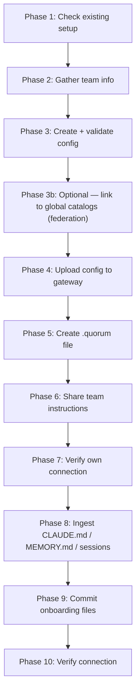

# Project Onboarding Protocol

Full 10-phase protocol for connecting a project to Quorum. Execute each phase using
your available tools (Bash, Read, Write). Only ask the human when explicitly noted.

---

## Phase 1 — Check for existing setup

```bash
ls -la .quorum *.quorum.json ~/.claude/skills/quorum/SKILL.md 2>/dev/null
```

If `.quorum` already exists → **stop immediately**. This project is already onboarded.
A project can only be onboarded once — the config in S3 is the authoritative record.
To connect a new machine to an existing Quorum project, skip to Phase 5 (create the
`.quorum` file) and Phase 6 (register the MCP). To update the project config, use the
dashboard Config editor or `POST /sync/configs`.

---

## Phase 2 — Gather team information

**Step 0 — Resolve the gateway and dashboard URLs (do this first)**

Quorum installations differ per team — never assume `localhost`. Resolve each URL
from the environment first; **only ask the human if it is not already set.**

```bash
# Gateway URL — already provided via MCP config / env?
echo "QUORUM_GATEWAY_URL=${QUORUM_GATEWAY_URL:-<unset>}"
# Dashboard URL — already provided via env?
echo "QUORUM_DASHBOARD_URL=${QUORUM_DASHBOARD_URL:-<unset>}"
```

| Variable | If set | If unset |
|----------|--------|----------|
| `QUORUM_GATEWAY_URL` | use it for every gateway call below | **Ask the human:** *"What is your Quorum gateway URL? (e.g. `https://quorum-gateway.yourco.com`)"* — then `export QUORUM_GATEWAY_URL="<answer>"` for this session. |
| `QUORUM_DASHBOARD_URL` | use it for every dashboard link shown to humans | **Ask the human:** *"What is your Quorum dashboard URL? (e.g. `https://quorum-dashboard.yourco.com`)"* — then `export QUORUM_DASHBOARD_URL="<answer>"`. (Optional — skip if the team has no dashboard; omit dashboard links if so.) |

Do not proceed to Step 1 until `QUORUM_GATEWAY_URL` resolves to a real value. There is
no localhost default — a wrong gateway silently writes to the wrong stack.

**Step 1 — Discover available global catalogs (before asking questions)**

Run this before showing the question prompt so question 5 can list real options:

```bash
HTTP_STATUS=$(curl -s -o /tmp/quorum-globals.json -w "%{http_code}" \
  "$QUORUM_GATEWAY_URL/api/globals" -H "Authorization: Bearer $QUORUM_JWT" 2>/dev/null)
echo "HTTP $HTTP_STATUS"
cat /tmp/quorum-globals.json 2>/dev/null
```

Handle the response by status:

| Status | Action |
|--------|--------|
| `200` | Parse `/tmp/quorum-globals.json`. Extract `group_id`, `display_name`, `global_scope` per entry. Use the list in question 5. |
| `401` | Call `authenticate()` via the MCP tool — token is missing or expired. Once auth completes, re-run the curl above and proceed. |
| Any other error or empty response | Skip gracefully: tell the engineer *"Gateway unreachable — I can't list available catalogs. Add `globals` to your config later via the Config editor."* |

**Step 2 — Ask the human in one prompt** (fill in the discovered catalog list for question 5):

> "To onboard this project I need:
> 1. **Project ID** — short slug, **hyphens allowed, underscores not** e.g. `platform-team` (default: current directory name)
>    The gateway enforces `/^[a-z0-9-]+$/` — use `my-project`, not `my_project`.
>    The gateway proxy normalises hyphens → underscores for Graphiti internally; callers never need to.
> 2. **Team members** — for each: name, GitHub username, git email, role
>    (`principal_architect` | `senior_engineer` | `engineer` | `junior`)
> 3. **Key domains** — any domain needing stricter governance e.g. `auth`, `payments`
>    (optional — standard thresholds apply otherwise)
> 4. **Org hierarchy** — where does this project sit in your org tree? (used for portfolio rollup + cascade filters)
>    - **Level**: `group` (business unit) | `division` (sub-group) | `department` | `service` (default — individual repo/service)
>    - **Node ID**: dot- or slash-separated org-tree path, e.g. `eng/platform` (omit if root-level)
>    - **Parent node ID**: the node_id of the parent, e.g. `eng` (omit for root projects)
>    - **Display name**: human-readable label shown in the portfolio table, e.g. `Platform Team`
>    - **Criticality**: integer 1–10 — business importance weight in the portfolio rollup (default: 1; use 3–5 for business-critical services)
> 5. **Global catalogs** — link to shared org standards to enable conformance scoring.
>    Available catalogs (from Step 1 above):
>    `<list group_id — display_name — global_scope for each discovered catalog>`
>    *(If none were discovered: you can add globals later via the Config editor.)*
>    Which catalogs should this project link to? (comma-separated group_ids, or 'none')
>
Do not proceed until you have at least a project ID and one team member.

> **Auth note:** Call `authenticate()` via the MCP tool before Phase 4. The PKCE browser
> flow issues a JWT scoped to your role. Phase 4 uses that JWT — no separate sync secret needed.

---

## Phase 3 — Create and validate config

Write `<project_id>.quorum.json` (filename must match the `group_id` value):

```json
{
  "$schema": "<QUORUM_GATEWAY_URL>/schema/config",
  "group_id": "<project_id>",
  "owner": "<github_username>",
  "members": [
    {
      "name": "<name>",
      "team": "<team>",
      "role": "<role>",
      "github_username": "<github_username>",
      "git_email": "<git_email>"
    }
  ],
  "roles": {
    "principal_architect": { "base_confidence": 0.90 },
    "senior_engineer":     { "base_confidence": 0.80 },
    "engineer":            { "base_confidence": 0.70 },
    "junior":              { "base_confidence": 0.60 }
  },
  "hierarchy": {
    "level":        "service",
    "node_id":      "<org-path>",
    "parent":       "<parent-node-id>",
    "display_name": "<display name>",
    "criticality":  1
  },
  "globals": [],
  "domains": {},
  "thresholds": {
    "conflict_threshold": 0.85,
    "authority_threshold": 0.20
  }
}
```

**Hierarchy field guide:**

| Field | Values | Purpose |
|-------|--------|---------|
| `level` | `group` \| `division` \| `department` \| `service` | Controls which Portfolio cascade filter dropdown this project appears in. `service` is the default for individual repos. |
| `node_id` | dot/slash path e.g. `eng/platform` | Org-tree position. Directors/VPs see only projects under their `node_id` subtree. |
| `parent` | parent's `node_id` e.g. `eng` | Links this project into the hierarchy; omit for root-level group projects. |
| `display_name` | `"Platform Team"` | Human-readable label shown in the portfolio table. |
| `criticality` | integer 1–10 | Rollup weight: `Σ(score × criticality) / Σ(criticality)`. Business-critical services should use 5–10. |

**`globals`** — list the `group_id` of any global catalog projects to link to (e.g. `["security-standards"]`). Leave as `[]` if none exist yet. This enables conformance scoring and deviation tracking against org-wide standards.

`group_id` and `owner` are both required fields.
- `group_id` — canonical identifier used as the S3 key, DDB primary key, and Graphiti namespace.
  **Must use hyphens, not underscores** (`my-project` not `my_project`): the gateway schema
  enforces `/^[a-z0-9-]+$/`. The gateway Graphiti proxy normalises hyphens → underscores
  internally before passing to FalkorDB — callers never need to know about this.
- `owner` — GitHub username of the project owner (required for governance, transfer-of-ownership, role updates).
- `project` — optional display name; omit it unless you want a different label in the dashboard.

Add domain overrides if provided:
```json
"auth": { "conflict_threshold": 0.90, "required_reviewer_teams": ["platform"] }
```

Validate before uploading:
```bash
GATEWAY_URL="$QUORUM_GATEWAY_URL"
curl -s -X POST "$GATEWAY_URL/config/validate" \
  -H "Content-Type: application/json" \
  -d @"${PROJECT_ID}.quorum.json"
```

If `"valid": false` → fix errors in the response, re-validate. Do not continue until `"valid": true`.

---

## Phase 3b — Optional: Link to global catalogs (federation)

Skip this phase if your project is a standalone team with no shared engineering or compliance standards.
Come back to it once your organisation has a global catalog project to link to.

**What is federation?**
A *global catalog* is a Quorum project with `is_global: true`. It acts as a shared library of
standards (security baselines, API design rules, compliance requirements). When your project links
to a global catalog, Claude can:
- Search global catalog entries alongside your project's knowledge
- Record deviations when your code violates a catalog standard
- Report a conformance score that tells you how well you track the org standard

**Step 1 — Add v0.4 fields to your config file**

Extend the `<project_id>.quorum.json` created in Phase 3 with any of these optional fields:

```json
{
  "$schema": "<QUORUM_GATEWAY_URL>/schema/config",
  "group_id": "<project_id>",
  "owner": "<github_username>",

  // Link to one or more global catalog projects
  "globals": ["security-standards", "api-design-catalog"],

  // Set to true only if THIS project IS the global catalog
  // (most projects leave this false)
  "is_global": false,

  // Organisational hierarchy — used by portfolio rollup to scope what directors/VPs see
  "hierarchy": {
    "level":        "service",          // 'group' | 'division' | 'department' | 'service'
    "node_id":      "eng/platform",     // dot- or slash-separated path in org tree
    "parent":       "eng",              // parent node_id (omit for root)
    "display_name": "Platform Team",    // human-readable label in portfolio table
    "criticality":  3                   // rollup weight 1–5 (default 1; use 3–5 for business-critical)
  },

  "members": [...],
  "roles": {...},
  "domains": {},
  "thresholds": {...}
}
```

**Step 2 — Discover available global catalogs**

*(If you are adding federation after initial onboarding, the list may have changed — re-run discovery now. During initial onboarding this was already done in Phase 2 Step 1.)*

```bash
GATEWAY_URL="$QUORUM_GATEWAY_URL"
HTTP_STATUS=$(curl -s -o /tmp/quorum-globals.json -w "%{http_code}" \
  "$GATEWAY_URL/api/globals" -H "Authorization: Bearer $QUORUM_JWT" 2>/dev/null)
echo "HTTP $HTTP_STATUS" && cat /tmp/quorum-globals.json
```

If HTTP 401 → call `authenticate()` via the MCP tool, then re-run the command above.

This returns all `is_global: true` projects visible to your role. The `global_scope` field
tells you the intended audience:
- `org` — visible to all projects
- `division` — visible to projects under the same division hierarchy node
- `department` — visible to projects under the same department hierarchy node

**Step 3 — Validate and check global catalog membership**

Add the relevant `group_id` values to the `globals` array in your config. Constraints:
- `globals` cannot include your own `group_id` (self-reference is rejected with 400)
- Each catalog listed must have `is_global: true` — a reference to a non-global project
  generates a `globals_warnings` entry in the `POST /sync/configs` response

Re-validate after adding `globals`:

```bash
GATEWAY_URL="$QUORUM_GATEWAY_URL"
curl -s -X POST "$GATEWAY_URL/config/validate" \
  -H "Content-Type: application/json" \
  -d @"${PROJECT_ID}.quorum.json"
```

**Step 4 — Note: catalog membership is controlled by the catalog owner**

Linking a catalog in `globals` enables your project to **read** catalog knowledge and
record deviations. It does not grant write access to the catalog — only the catalog's
`principal_architect` can add entries to it.

If you are not yet a catalog member, ask the catalog's `principal_architect` to add
your GitHub username to the catalog's `members` list. Without membership, writes to
the catalog return `GLOBAL_WRITE_AUTHORITY`.

**After adding federation config:** proceed to Phase 4 (upload) as normal. The gateway
validates `globals` references during upload and returns `globals_warnings[]` for any
non-global catalogs referenced.

---

## Phase 4 — Upload config to gateway

Call `authenticate()` first if not already done — this stores the JWT in MCP server
memory. No token copying or manual Authorization headers are needed.

Then call the `config_upload` MCP tool directly:

```javascript
config_upload({ config_path: "<project_id>.quorum.json" })
```

The tool reads the file, POSTs to `POST /config/upload`, and injects the in-memory
JWT automatically. The gateway validates, stores in S3, and syncs to DynamoDB in
one call.

Expected response:
```json
{
  "status": "onboarded",
  "project_id": "<project_id>",
  "q_project_id": "q_p1",
  "message": "Project '...' onboarded successfully.",
  "next_step": "Add both project_id and q_project_id to your .quorum file:\n{\"gateway_url\":\"...\",\"project_id\":\"<project_id>\",\"q_project_id\":\"q_p1\"}"
}
```

**Save `q_project_id` from this response** — you will need it in Phase 5.
The `q_project_id` (e.g. `q_p1`) is the Quorum-assigned internal ID for fast routing;
`project_id` is the human-readable `group_id` slug kept for display.

An `{ "status": "already_onboarded", "q_project_id": "q_p1" }` response means the
project already exists in S3 — proceed to Phase 5. Save the `q_project_id` from this
response too. You are connecting to an existing project, not creating a new one.

---

## Phase 5 — Create the `.quorum` discovery file

First, resolve the CLI path:

```bash
# Option A — globally installed
which quorum && QUORUM_CLI="quorum"

# Option B — running from source (check MCP registration)
# claude mcp list shows the path to server.js — derive cli.js from it
QUORUM_CLI="node $(claude mcp list | grep quorum | grep -o '[^ ]*server\.js' | sed 's/dist\/server\.js/cli.js/' | sed 's/src\/server\.js/cli.js/')"
```

Then create the `.quorum` file:

```bash
$QUORUM_CLI init \
  --gateway-url "$QUORUM_GATEWAY_URL" \
  --project-id "$PROJECT_ID"
```

This writes a basic `.quorum` to the current directory. Then **add the `q_project_id`**
from the Phase 4 response to enable fast routing (skips a DB lookup per request):

```bash
# Use the exact JSON from the next_step field in the Phase 4 response, e.g.:
cat > .quorum << 'EOF'
{
  "gateway_url": "<QUORUM_GATEWAY_URL>",
  "project_id": "<project_id>",
  "q_project_id": "q_p1"
}
EOF
```

The MCP server auto-discovers `.quorum` by walking up the directory tree — no manual
env vars needed. When `q_project_id` is present, the server sends it in the
`X-Quorum-Project` header, bypassing a `group_id → q_project_id` DB lookup on every call.

---

## Phase 6 — Share onboarding instructions with the team

You are already connected (MCP running + skill installed — that's how this onboarding
is executing). Phase 6 is for **every other engineer** joining this project.

Send each engineer:

> **To connect your machine to the `<project_id>` Quorum project:**
>
> 1. Install the MCP server (if not already installed):
>    ```bash
>    npm install -g @as-quorum/mcp
>    ```
>    This runs `quorum install` automatically via postinstall — skill, hooks, and MCP
>    registration are all handled. No manual steps needed.
>
> 2. The `.quorum` file is already committed to the repo (Phase 9) — just pull and you're done.
>    It contains `gateway_url`, `project_id`, and `q_project_id` — no manual setup needed.
>
> 3. Open a new Claude Code session in the repo. Quorum will authenticate automatically
>    via GitHub OAuth on first use — no tokens or PATs required.

For CI contexts where no interactive browser is available, engineers set:
```bash
# CI only — not for interactive engineer sessions
export QUORUM_AUTHOR=your-github-username
```

---

## Phase 7 — Verify your own connection

```bash
ls ~/.claude/skills/quorum/SKILL.md ~/.claude/hooks/quorum-*.sh
```

Expected: SKILL.md and 5 hook scripts present. If missing, re-run `quorum install`.

---

## Phase 8 — Ingest existing project knowledge

This is the highest-value step. CLAUDE.md, MEMORY.md, and session transcripts contain
institutional knowledge that should be governed — not just living in flat files.

**Before writing anything, call `set_agent_context` first** (Gate 3 blocks all write
tools until this is done):

```javascript
set_agent_context({ agent_id: "claude-code-onboarding" })
```

**8a — CLAUDE.md**

```bash
cat CLAUDE.md 2>/dev/null || cat .claude/CLAUDE.md 2>/dev/null
```

Extract every statement that is a decision, constraint, pattern, or named convention.
Call `remember()` for each — classify by domain and key:

```javascript
remember("api", "error-standards",
  "All API errors follow RFC 7807 Problem Detail: type, title, status, detail", {
  confidence: 0.75,
  tags: ["api", "errors", "conventions"]
})
```

All entries enter as `DRAFT` with `triggered_by: onboard`.

**8b — MEMORY.md**

```bash
# Claude Code auto-memory location
cat ~/.claude/projects/$(echo $PWD | tr '/' '-')/memory/MEMORY.md 2>/dev/null
cat .claude/memory/MEMORY.md 2>/dev/null
```

Extract architecture choices, technology decisions, and constraints.

**8c — Recent session transcripts** (ask human first)

> "I can extract knowledge from your recent Claude Code session transcripts.
> Want me to do that? (I'll only read sessions from this project directory.)"

```bash
# Find recent sessions
ls -lt ~/.claude/projects/$(echo $PWD | tr '/' '-')/*.jsonl 2>/dev/null | head -5
```

Read the most recent 1–3 sessions. Look for decisions made with stated rationale.
Call `search()` first for each candidate — do not re-ingest what is already in Quorum.

**Before extracting from transcripts:**
- Scan for secrets, tokens, passwords, PII (email addresses, names in sensitive context)
- Never store raw transcript content — extract only the architectural decision or constraint
- If a section contains credentials or personal data, skip it entirely
- Paraphrase; do not quote conversation verbatim into Quorum knowledge entries

---

## Phase 9 — Commit onboarding files

The config file lives outside the repo (gitignored — it contains real usernames/emails
and is uploaded to S3). Only commit the `.quorum` discovery file:

First, ensure runtime artifacts are gitignored:

```bash
echo '*.quorum.json' >> .gitignore
echo '.quorum-session' >> .gitignore
echo '.quorum-reflected' >> .gitignore
echo '.quorum-offline.log' >> .gitignore
```

Then commit:

```bash
git add .quorum .gitignore
git commit -m "chore: onboard project to Quorum governed memory

- .quorum: gateway auto-discovery file (walks up directory tree)
- .gitignore: exclude quorum config, session state, and offline log

Config (<group_id>.quorum.json) is gitignored — it is uploaded to S3,
not committed. Skill is installed user-level at ~/.claude/skills/quorum/."
```

Do not commit `.env`, `*.quorum.json` config files, or files containing tokens.

---

## Phase 10 — Verify connection

Start a fresh Claude Code session in the project directory and run:

> "What pending Quorum decisions are there?"

Expected: `pending()` returns DRAFT entries from Phase 8, or "No pending items."

If Quorum is unreachable:
```bash
curl "$QUORUM_GATEWAY_URL/health"
# Expected: { "status": "healthy", "components": { "postgresql": "connected",
#   "graphiti": "connected", "falkordb": "connected", "s3": "connected" } }
```

---

## Summary


