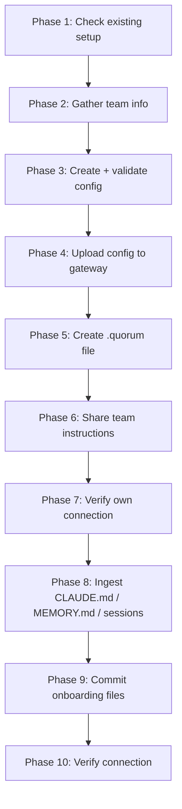

# Project Onboarding Protocol

Full 10-phase protocol for connecting a project to Quorum. Execute each phase using
your available tools (Bash, Read, Write). Only ask the human when explicitly noted.

---

## Phase 1 — Check for existing setup

```bash
ls -la .quorum *.quorum.json ~/.claude/skills/quorum/SKILL.md 2>/dev/null
```

If `.quorum` already exists → **stop immediately**. This project is already onboarded.
A project can only be onboarded once — the config in S3 is the authoritative record.
To connect a new machine to an existing Quorum project, skip to Phase 5 (create the
`.quorum` file) and Phase 6 (register the MCP). To update the project config, use the
dashboard Config editor or `POST /sync/configs`.

---

## Phase 2 — Gather team information

Ask the human in **one prompt**:

> "To onboard this project I need:
> 1. **Project ID** — short slug e.g. `platform-team` (default: current directory name)
> 2. **Team members** — for each: name, GitHub username, git email, role
>    (`principal_architect` | `senior_engineer` | `engineer` | `junior`)
> 3. **Key domains** — any domain needing stricter governance e.g. `auth`, `payments`
>    (optional — standard thresholds apply otherwise)
> 4. **Gateway URL** — where Quorum gateway is running (default: `http://localhost:3001`)
>
Do not proceed until you have at least a project ID and one team member.

> **Auth note:** Call `authenticate()` via the MCP tool before Phase 4. The PKCE browser
> flow issues a JWT scoped to your role. Phase 4 uses that JWT — no separate sync secret needed.

---

## Phase 3 — Create and validate config

Write `<project_id>.quorum.json` (filename must match the `group_id` value):

```json
{
  "$schema": "http://localhost:3001/schema/config",
  "group_id": "<project_id>",
  "members": [
    {
      "name": "<name>",
      "team": "<team>",
      "role": "<role>",
      "github_username": "<github_username>",
      "git_email": "<git_email>"
    }
  ],
  "roles": {
    "principal_architect": { "base_confidence": 0.90 },
    "senior_engineer":     { "base_confidence": 0.80 },
    "engineer":            { "base_confidence": 0.70 },
    "junior":              { "base_confidence": 0.60 }
  },
  "domains": {},
  "thresholds": {
    "conflict_threshold": 0.85,
    "authority_threshold": 0.20
  }
}
```

`group_id` is the only required field — it is the canonical identifier used as the
S3 key, DDB primary key, JWT claim, and Graphiti namespace. `project` is an optional
display name; omit it unless you want a different label in the dashboard.

Add domain overrides if provided:
```json
"auth": { "conflict_threshold": 0.90, "required_reviewer_teams": ["platform"] }
```

Validate before uploading:
```bash
GATEWAY_URL="${QUORUM_GATEWAY_URL:-http://localhost:3001}"
curl -s -X POST "$GATEWAY_URL/config/validate" \
  -H "Content-Type: application/json" \
  -d @"${PROJECT_ID}.quorum.json"
```

If `"valid": false` → fix errors in the response, re-validate. Do not continue until `"valid": true`.

---

## Phase 4 — Upload config to gateway

Call `authenticate()` first if not already done — this stores the JWT in MCP server
memory. No token copying or manual Authorization headers are needed.

Then call the `config_upload` MCP tool directly:

```javascript
config_upload({ config_path: "<project_id>.quorum.json" })
```

The tool reads the file, POSTs to `POST /config/upload`, and injects the in-memory
JWT automatically. The gateway validates, stores in S3, and syncs to DynamoDB in
one call.

Expected response:
```json
{ "status": "onboarded", "project_id": "<project_id>", "message": "Project '...' onboarded successfully." }
```

A `{ "status": "already_onboarded" }` response means the project already exists in
S3 — proceed to Phase 5. You are connecting to an existing project, not creating a
new one.

---

## Phase 5 — Create the `.quorum` discovery file

First, resolve the CLI path:

```bash
# Option A — globally installed
which quorum && QUORUM_CLI="quorum"

# Option B — running from source (check MCP registration)
# claude mcp list shows the path to server.js — derive cli.js from it
QUORUM_CLI="node $(claude mcp list | grep quorum | grep -o '[^ ]*server\.js' | sed 's/dist\/server\.js/cli.js/' | sed 's/src\/server\.js/cli.js/')"
```

Then create the `.quorum` file:

```bash
$QUORUM_CLI init \
  --gateway-url "${QUORUM_GATEWAY_URL:-http://localhost:3001}" \
  --project-id "$PROJECT_ID"
```

This writes `.quorum` to the current directory. The MCP server auto-discovers it
by walking up the directory tree — no manual env vars needed.

---

## Phase 6 — Share onboarding instructions with the team

You are already connected (MCP running + skill installed — that's how this onboarding
is executing). Phase 6 is for **every other engineer** joining this project.

Send each engineer:

> **To connect your machine to the `<project_id>` Quorum project:**
>
> 1. Install the MCP server (if not already installed):
>    ```bash
>    npm install -g @as-quorum/mcp
>    ```
>    This runs `quorum install` automatically via postinstall — skill, hooks, and MCP
>    registration are all handled. No manual steps needed.
>
> 2. Create the project discovery file in the repo root:
>    ```bash
>    quorum init \
>      --gateway-url "<QUORUM_GATEWAY_URL>" \
>      --project-id "<project_id>"
>    ```
>    (The `.quorum` file will already be committed after Phase 9 — just pull and you're done.)
>
> 3. Open a new Claude Code session in the repo. Quorum will authenticate automatically
>    via GitHub OAuth on first use — no tokens or PATs required.

For CI contexts where no interactive browser is available, engineers set:
```bash
# CI only — not for interactive engineer sessions
export QUORUM_AUTHOR=your-github-username
```

---

## Phase 7 — Verify your own connection

```bash
ls ~/.claude/skills/quorum/SKILL.md ~/.claude/hooks/quorum-*.sh
```

Expected: SKILL.md and 5 hook scripts present. If missing, re-run `quorum install`.

---

## Phase 8 — Ingest existing project knowledge

This is the highest-value step. CLAUDE.md, MEMORY.md, and session transcripts contain
institutional knowledge that should be governed — not just living in flat files.

**8a — CLAUDE.md**

```bash
cat CLAUDE.md 2>/dev/null || cat .claude/CLAUDE.md 2>/dev/null
```

Extract every statement that is a decision, constraint, pattern, or named convention.
Call `remember()` for each — classify by domain and key:

```javascript
remember("api", "error-standards",
  "All API errors follow RFC 7807 Problem Detail: type, title, status, detail", {
  confidence: 0.75,
  tags: ["api", "errors", "conventions"]
})
```

All entries enter as `DRAFT` with `triggered_by: onboard`.

**8b — MEMORY.md**

```bash
# Claude Code auto-memory location
cat ~/.claude/projects/$(echo $PWD | tr '/' '-')/memory/MEMORY.md 2>/dev/null
cat .claude/memory/MEMORY.md 2>/dev/null
```

Extract architecture choices, technology decisions, and constraints.

**8c — Recent session transcripts** (ask human first)

> "I can extract knowledge from your recent Claude Code session transcripts.
> Want me to do that? (I'll only read sessions from this project directory.)"

```bash
# Find recent sessions
ls -lt ~/.claude/projects/$(echo $PWD | tr '/' '-')/*.jsonl 2>/dev/null | head -5
```

Read the most recent 1–3 sessions. Look for decisions made with stated rationale.
Call `search()` first for each candidate — do not re-ingest what is already in Quorum.

**Before extracting from transcripts:**
- Scan for secrets, tokens, passwords, PII (email addresses, names in sensitive context)
- Never store raw transcript content — extract only the architectural decision or constraint
- If a section contains credentials or personal data, skip it entirely
- Paraphrase; do not quote conversation verbatim into Quorum knowledge entries

---

## Phase 9 — Commit onboarding files

The config file lives outside the repo (gitignored — it contains real usernames/emails
and is uploaded to S3). Only commit the `.quorum` discovery file:

First, ensure runtime artifacts are gitignored:

```bash
echo '*.quorum.json' >> .gitignore
echo '.quorum-reflected' >> .gitignore
echo '.quorum-offline.log' >> .gitignore
```

Then commit:

```bash
git add .quorum .gitignore
git commit -m "chore: onboard project to Quorum governed memory

- .quorum: gateway auto-discovery file (walks up directory tree)
- .gitignore: exclude quorum config, session state, and offline log

Config (<group_id>.quorum.json) is gitignored — it is uploaded to S3,
not committed. Skill is installed user-level at ~/.claude/skills/quorum/."
```

Do not commit `.env`, `*.quorum.json` config files, or files containing tokens.

---

## Phase 10 — Verify connection

Start a fresh Claude Code session in the project directory and run:

> "What pending Quorum decisions are there?"

Expected: `pending()` returns DRAFT entries from Phase 8, or "No pending items."

If Quorum is unreachable:
```bash
curl http://localhost:3001/health
# Expected: { "status": "healthy", "components": { "postgresql": "connected",
#   "graphiti": "connected", "falkordb": "connected", "s3": "connected" } }
```

---

## Summary


